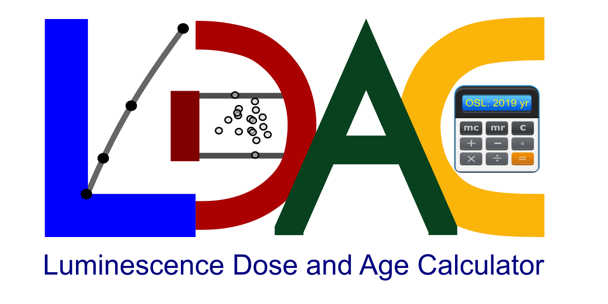

# Luminescence Dose and Age Calculator (LDAC v1.0)

The Luminescence Dose and Age Calculator (LDAC) is a Microsoft Excel Visual Basic Application (VBA)-based package which can be used to assemble OSL age information and associated calculations. This platform applies statistical models to determine equivalent dose (De) values and render corresponding OSL age estimates. This software is fully applicable for De measurements by single grain and aliquot regeneration (SAR) and thermal transfer OSL (TT-OSL) protocols. It could also be used to calculate the dose rate and final buried age for geology/archaeology samples.

The LDAC is continuously being developed and improved. The most recent (July 22, 2019) distribution of LDAC can be downloaded above or at the webpage of Geoluminescence Dating Research Lab, Baylor University (https://www.baylor.edu/geosciences/index.php?id=962356). A training vedio can be viewed on Youtube https://www.youtube.com/watch?v=Of_feY1UeqU.

Note: Click the folder "LDAC software (v1.0)" and download the zip file "LDAC software (v1.0).zip". Then, unzip the download file and the “LDAC (v1.0).xlsm” will be found.

Any bug-reports, suggestions, and even requirements for further developing the LDAC are warmly welcome. Please contact Peng Liang (Peng_Liang1@Baylor.edu; LiangPeng2012@live.cn) or Steven L. Forman (Steven_Forman@Baylor.edu).
